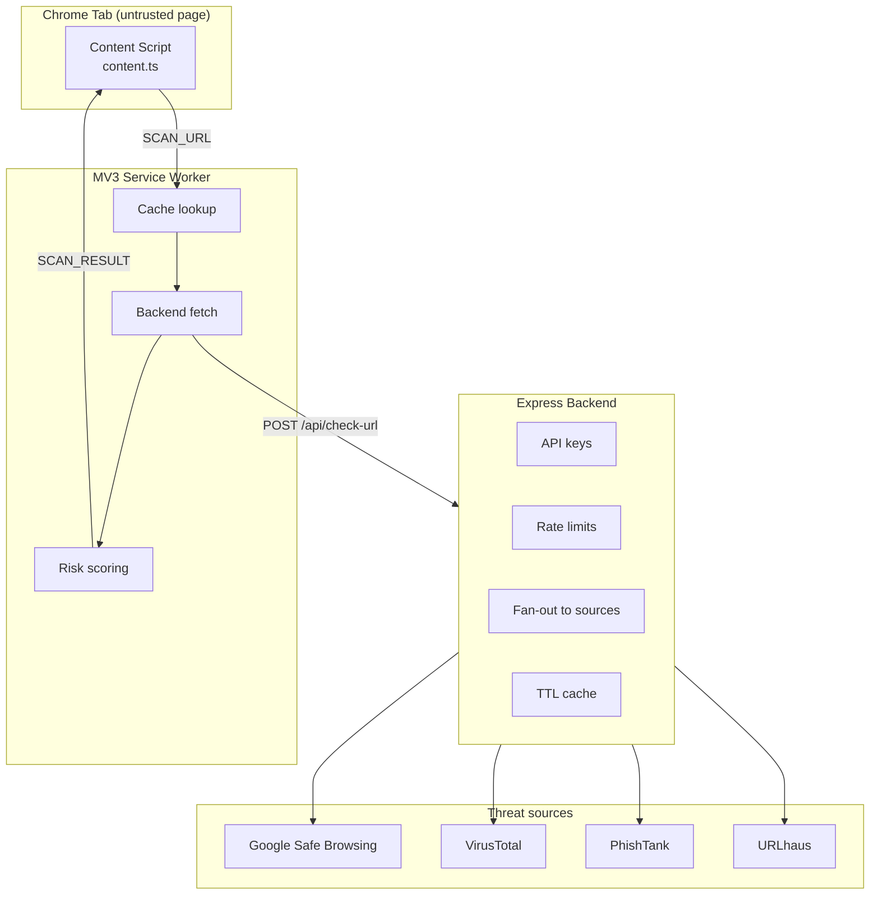

# Architecture

## High-level



## Components

### Extension (`extension/`)

Built with TypeScript, bundled by esbuild into three entry points. All
third-party threat lookups go through the backend — the extension never holds
API keys.

| File | Role |
|------|------|
| `src/background/service-worker.ts` | MV3 background. Owns the URL cache and the backend request. |
| `src/content/content.ts` | Runs on every http(s) page. Sends the URL to the service worker, renders the warning overlay if the verdict is not `safe`. |
| `src/popup/` | Toolbar UI. Shows the current tab's verdict. |
| `src/lib/*` | Shared logic: types, constants, cache, fetch helper, risk scorer. |

### Backend (`backend/`)

Small Express app. Its only job is to hold API keys and normalize responses
from the four threat sources.

| File | Role |
|------|------|
| `src/index.ts` | Wiring: env, cache, services, aggregator, router, HTTP server. |
| `src/lib/env.ts` | Typed env reader. Loads `.env` from the repo root regardless of cwd. Fails hard on missing keys in production; warns in development. |
| `src/lib/cache.ts` | In-memory TTL cache. |
| `src/services/*.ts` | One class per threat source, plus the aggregator. |
| `src/routes/check-url.ts` | `POST /api/check-url` handler. |

## Manifest V3 service-worker lifecycle

The MV3 service worker is **ephemeral**. Chrome spins it up when a message
arrives and tears it down when idle. Consequences:

1. **All event listeners are registered synchronously at the top of
   `service-worker.ts`.** Registering inside an `async` callback means the
   listener may never attach after a restart.
2. **No module-level mutable state.** Anything persisted across restarts lives
   in `chrome.storage.local`, which is the source of truth for the URL cache.
3. **Every message handler returns a response, even on error.** The content
   script would otherwise hang.

## Content script vs. service worker

| Concern | Content script | Service worker |
|---------|---------------|----------------|
| Read page URL | ✅ via `window.location` | ❌ (no DOM access) |
| Render warning overlay | ✅ (can modify DOM) | ❌ |
| Call the backend | ❌ (no host permission for arbitrary fetches) | ✅ |
| Cache results | ❌ | ✅ |
| Survive page navigations | ❌ (new instance per page) | ✅ |

The split is enforced by capability, not preference. Content script detects;
service worker decides; content script renders.

## Permission scoping

`manifest.json` requests only what is used:

| Permission | Why | What we deliberately omitted |
|-----------|-----|------------------------------|
| `storage` | Persist the URL cache across service-worker restarts. | — |
| `activeTab` | Read the current tab's URL when the popup opens. | — |
| Host: `http://localhost:8787/*` | Talk to the backend during development. | No `<all_urls>` host permission — content script `matches` covers page injection without it. No `tabs`, `webRequest`, `scripting`, or `declarativeNetRequest`. |

## API latency and timeouts

Every outbound HTTP request has an `AbortController`-based timeout:

| Where | Timeout |
|-------|---------|
| Extension → backend | 6 s (`fetchWithTimeout` in `extension/src/lib`) |
| Backend → Google Safe Browsing | 5 s |
| Backend → VirusTotal (submit and report) | 8 s each |
| Backend → URLhaus | 6 s |
| Backend → PhishTank | 6 s |

The extension fires one request to the backend. The backend fires four
requests in parallel (`Promise.allSettled`), so total wall time is bounded by
the slowest source, not their sum.

## Failed or unavailable services

The aggregator uses `Promise.allSettled` and includes only the fulfilled
signals in its response. A failed source is logged and skipped; the response
still returns `200`. If **all** sources fail, the response carries an empty
signals array — the extension interprets that as "unknown" and reports it in
the popup as "No sources responded."

This is **fail-open**: the user is never blocked because a source is down. The
alternative (fail-closed) would be appropriate for enterprise but produces
unacceptable false positives for a consumer tool.

**Live example from the current build:**

```
[aggregator] phishtank failed: PhishTank responded 403
```

PhishTank's 403 — because the provider has disabled new-user registration —
is caught, logged, and excluded. The other three sources respond normally and
the request returns `200`.

## Caching

Two caches, both TTL-based:

| Cache | Location | TTL | Purpose |
|-------|----------|-----|---------|
| Extension-side | `chrome.storage.local` | 1 hour | Avoids a round-trip to the backend for URLs the user revisits. |
| Backend-side | In-memory `Map` | 1 hour | Avoids hitting the rate-limited external APIs for URLs multiple users ask about. |

The extension cache is intentionally small (200 entries) and prunes
oldest-inserted-first. The backend cache is bounded at 500 entries by default
(`CACHE_MAX_ENTRIES`).

## False positives and false negatives

- **False positive prevention:** a single weak signal produces `suspicious`,
  not `dangerous`. `dangerous` requires either Google Safe Browsing or a
  combination of weaker sources crossing the 50-point threshold.
- **False negative mitigation:** four independent sources cover different
  threat classes — malware distribution (Google, URLhaus), phishing
  (PhishTank), and a broad multi-engine aggregation (VirusTotal).
- **No auto-blocking.** The extension warns; the user retains control. This is
  a deliberate trade-off: a blocking extension that flags a legitimate page is
  far more damaging to user trust than one that shows a warning.

## Safe handling of untrusted data

- The content script builds the overlay entirely with `document.createElement()`
  and `textContent`. **`innerHTML` is never used** anywhere in the codebase.
  Reasons displayed to the user come from external API responses and are
  treated as untrusted strings.
- The backend validates and sanitizes the incoming URL (`isHttpUrl`) before
  making any outbound request.
- The extension validates the backend's response shape with a runtime type
  guard (`isScanResponse`) before using it.
- `ThreatSignal.detail` is a free-form string from third-party APIs. It is
  rendered only via `textContent` and never interpolated into markup.
- The extension maintains an allowlist of source identifiers (`VALID_SOURCES`
  in `threat-apis.ts`). Any signal whose `source` field is not on the list
  causes the whole response to be rejected as malformed. This is a deliberate
  strictness: it prevents an unknown or malformed source from silently
  influencing the score. During development, a bug appeared where the URLhaus
  source was added to the backend before the extension's allowlist was
  updated — the response was rejected and the extension fell back to a
  "No sources responded" state, which is exactly the fail-safe behavior this
  guard is meant to produce. The guard is intentional, not accidental.

## Security considerations for production

1. **API keys live only on the backend.** The extension bundle contains no
   secrets. This is why a backend exists at all.
2. **CORS is open in development** (`cors({ origin: true })`). In production,
   restrict to the extension's origin.
3. **Input size limit** on the backend (`express.json({ limit: '4kb' })`)
   prevents large-payload abuse.
4. **No PII storage.** The cache stores URLs, not user identity. TTL ensures
   minimal retention.
5. **HTTPS only** for outbound calls in production. Development uses HTTP to
   `localhost:8787` only.
6. **Rate limiting** on the backend is not implemented in this MVP; it is one
   of the first additions required before public deployment.
7. **Dotenv path is explicit.** `backend/src/lib/env.ts` loads `.env` from
   the repo root via `fileURLToPath` + `path.resolve`, so the file is read
   consistently regardless of the current working directory.

## Build pipeline

- **Extension:** esbuild bundles three TypeScript entry points into `dist/`.
  Static assets (manifest, HTML, CSS, icons) are copied verbatim by
  `esbuild.config.mjs`.
- **Backend:** `tsc` compiles `src/` to `dist/`.
- **Root:** `npm run build` runs both in sequence.